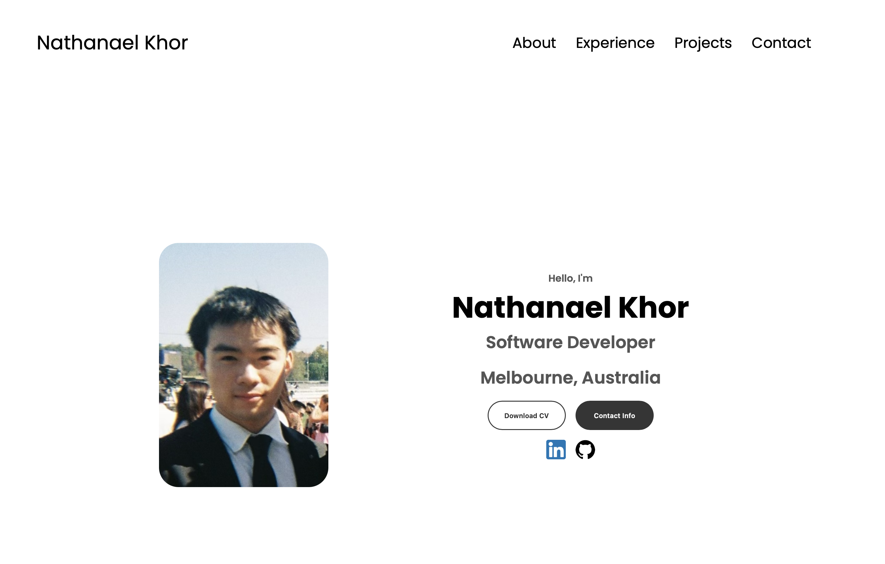

# My ePortfolio

A responsive personal portfolio website showcasing my skills, experience, projects, and contact information.



## Table of Contents

- [Overview](#overview)
- [Features](#features)
- [Technologies Used](#technologies-used)
- [Project Structure](#project-structure)
- [Setup and Installation](#setup-and-installation)
- [Usage](#usage)
- [Customization](#customization)
- [License](#license)
- [Contact](#contact)

## Overview

This is a personal portfolio website designed to showcase my skills, experience, and projects as a software developer. The website is fully responsive and includes sections for about me, experience, projects, and contact information.

## Features

- **Responsive Design**: Adapts to different screen sizes (mobile, tablet, desktop)
- **Navigation**: Both desktop navigation and mobile hamburger menu
- **Animated Sections**: Scroll animations for improved user experience
- **Project Showcase**: Display of recent projects with descriptions and links
- **Contact Information**: Easy access to contact details and social media profiles
- **PDF Resume Download**: Option to download CV/resume

## Technologies Used

- HTML
- CSS3
- JavaScript
- Intersection Observer API (for scroll animations)

## Project Structure

```
My-ePortfolio/
├── assets/             # Images and downloadable files
├── .vscode/            # VS Code configuration
├── app.js              # JavaScript for scroll animations
├── index.html          # Main HTML structure
├── mediaqueries.css    # Responsive design styles
├── script.js           # JavaScript for interactive elements
└── style.css           # Main CSS styles
```

## Setup and Installation

1. Clone the repository:
   ```bash
   git clone https://github.com/yourusername/My-ePortfolio.git
   ```

2. Navigate to the project directory:
   ```bash
   cd My-ePortfolio
   ```

3. Open the project in your code editor (e.g., VS Code)

4. Launch the website using a local server:
   - If you have VS Code with Live Server extension, right-click `index.html` and select "Open with Live Server"
   - Alternatively, you can use any local server of your choice

## Usage

- The website is organized into sections: Profile, About, Experience, Projects, and Contact
- Navigate through sections using the navigation links at the top
- On mobile devices, use the hamburger menu to access navigation
- Download the resume/CV by clicking the "Download CV" button
- Access social media profiles through the links provided
- View project details and access GitHub repositories or live demos through the project section

## Contact

Nathanael Khor - [nwxkhor@gmail.com](mailto:nwxkhor@gmail.com) - [LinkedIn](https://www.linkedin.com/in/nathanael-khor-02472530a/)
